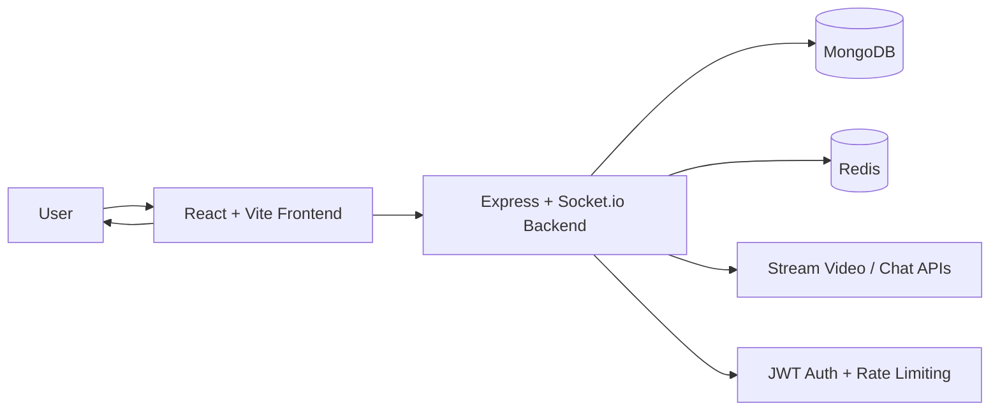

# Callify — MERN Social Calling & Messaging Platform

Callify is a full-stack real-time communication app for chatting, friend networking, onboarding, and 1:1 video calling. Built with the MERN stack, Socket.io, and Stream Video, it combines social messaging workflows with production-ready authentication and real-time presence features.

## 🚀 Highlights
- Real-time chat with live socket updates
- 1:1 video calling via Stream Video SDK
- Friend request and contact discovery flows
- Profile onboarding and profile editing
- WhatsApp-inspired UI with a mobile-first social layout
- JWT-based auth and protected API routes
- MongoDB-backed persistence with Redis caching support
- Twilio-ready OTP flow for production SMS verification

## 🧠 Why this project matters
This project demonstrates:
- Full-stack product development with a modern frontend/backend split
- Real-time system design using WebSockets and signaling patterns
- Secure auth and protected route handling
- Deployment-friendly architecture for a social communication platform
- Practical trade-offs between chat, media, and user presence systems

## 🏗️ Architecture Overview



### High-level flow
1. User signs in or completes onboarding
2. Frontend connects to the backend socket server
3. Messages and presence updates are broadcast in real time
4. Users discover friends and initiate calls from the app
5. Stream Video handles the media session while the backend manages auth and data
6. MongoDB stores user, chat, and profile data

## 🛠️ Tech Stack
### Frontend
- React 19
- Vite
- Tailwind CSS
- DaisyUI
- React Router
- TanStack Query
- Socket.IO client
- Stream Chat / Stream Video SDKs

### Backend
- Node.js
- Express
- MongoDB + Mongoose
- Socket.IO
- JWT authentication
- Redis caching
- Twilio Verify integration for OTP

## ✅ Features
- Real-time instant messaging
- 1:1 video calling
- Friend requests and connection discovery
- Onboarding + profile editing
- Social dashboard and chat experience inspired by WhatsApp
- Socket-based presence and live updates
- Development-friendly OTP fallback and production Twilio-ready flow

## 🔐 Security & Reliability
- JWT-protected routes
- Rate limiting for auth and general API access
- CORS allowlist for trusted origins
- Cookie-based session handling for authenticated requests
- Safe uploads and static asset serving for media content
- Redis and MongoDB integration for scalable app state and persistence

## 📈 Observability (recommended)
Track metrics such as:
- `api_request_total`
- `auth_success_total`
- `auth_failure_total`
- `socket_connection_total`
- `socket_disconnect_total`
- `call_start_total`
- `call_join_success_total`
- `active_users`
- `active_rooms`

## 🧪 Testing Strategy (recommended)
- Unit tests for auth middleware, validators, and helper logic
- Integration tests for chat and friend request flows
- Socket event validation for real-time message delivery
- End-to-end smoke test for login, chat, and video call initiation

## ⚖️ Scaling Notes
- The current architecture is suited for a single-instance MVP and early deployment
- Horizontal scaling path:
  - move session and presence state to Redis-backed services
  - scale the Node.js backend behind a load balancer
  - keep Socket.io sticky sessions consistent across instances
- Video/media workloads may eventually benefit from a dedicated media orchestration service or SFU-based design

## 📊 Performance Snapshot
> Replace with real values after measurement.
- Concurrent users tested: **X**
- Concurrent rooms tested: **Y**
- Median call setup time: **Z sec**
- Reconnect success rate: **A%**

## 🗺️ Roadmap
- [ ] Add network quality and connection health indicators
- [ ] Improve reconnect and retry logic for unstable sessions
- [ ] Add screen sharing support
- [ ] Add automated end-to-end smoke tests
- [ ] Add Redis-backed session/presence scaling
- [ ] Improve notification and push-style event handling

## ⚙️ Local Development

### Prerequisites
- Node.js 18+
- MongoDB (local or cloud)
- Redis (optional for local caching/testing)

### Setup
```bash
# clone the repo
git clone https://github.com/abhiishek306/callify.git
cd callify

# install workspace dependencies
npm install
```

### Environment variables
Create a `.env` file inside the `backend` folder:

```bash
PORT=5001
MONGO_URI=your_mongodb_connection_string
JWT_SECRET=your_jwt_secret
NODE_ENV=development
STREAM_API_KEY=your_stream_key
STREAM_API_SECRET=your_stream_secret
REDIS_URL=redis://localhost:6379

# Optional production SMS OTP setup
TWILIO_ACCOUNT_SID=your_twilio_account_sid
TWILIO_AUTH_TOKEN=your_twilio_auth_token
TWILIO_VERIFY_SERVICE_SID=your_twilio_verify_service_sid
```

### Run locally
```bash
# run frontend + backend together
npm run dev
```

This starts:
- backend on the configured port
- frontend via Vite dev server

### Run backend only
```bash
npm run start --prefix backend
```

### Run frontend only
```bash
npm run dev --prefix frontend
```

## 🚀 Production Build
```bash
npm run build
```

This builds the frontend bundle for production deployment.

## 🌐 Deployment
Live demo: https://callify-ki5o.onrender.com

This project is designed to deploy well on platforms like Render, with:
- Frontend: static site deployment
- Backend: Node.js service
- Database: MongoDB Atlas
- Cache: managed Redis service
- Environment variables: configured in the deployment dashboard

## 🎥 Demo
- Live: https://callify-ki5o.onrender.com
- Video walkthrough: add your demo link here

## 🧪 Week 2 Differentiators

### Reconnect robustness
- idempotent room joins prevent duplicate socket membership
- duplicate room joins are ignored instead of re-adding the same socket to the same room
- reconnect events restore room state when a client re-enters a room

### Smoke test coverage
- room lifecycle smoke test validates that two clients can join a shared room and receive participant updates
- the test is designed to exercise the real Socket.io room path without mocking the transport layer

### Network quality indicator
- lightweight connection-quality badge uses browser network hints (effective type, RTT, downlink) when available
- this provides a practical UI signal for call readiness without requiring full WebRTC stats instrumentation

### Redis-ready scaling
- the socket server detects `REDIS_URL` and enables the Socket.io Redis adapter when configured
- this enables multi-instance signaling for shared room/presence state in production

## 📁 Project Structure
```bash
callify/
├── backend/
│   ├── src/
│   ├── package.json
│   └── uploads/
├── frontend/
│   ├── src/
│   ├── public/
│   ├── package.json
│   └── vite.config.js
├── package.json
├── README.md
├── docker-compose.yml
├── Dockerfile
├── render.yaml
└── .gitignore
```

## License
This project is currently intended for educational and portfolio use.

## Author
Built as a real-time social communication prototype with a modern WhatsApp-inspired user experience.
